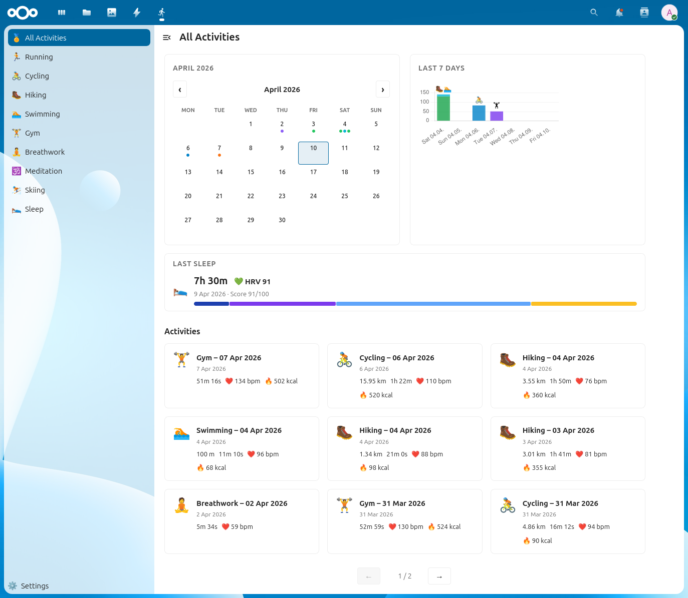
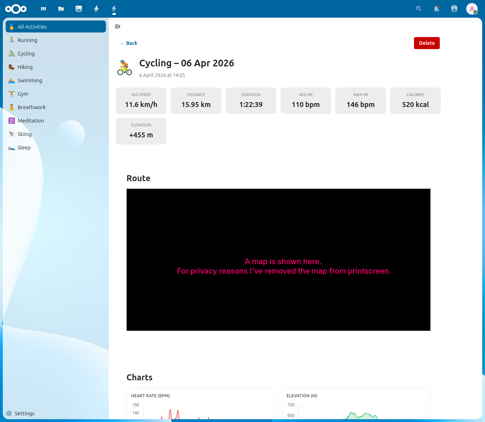
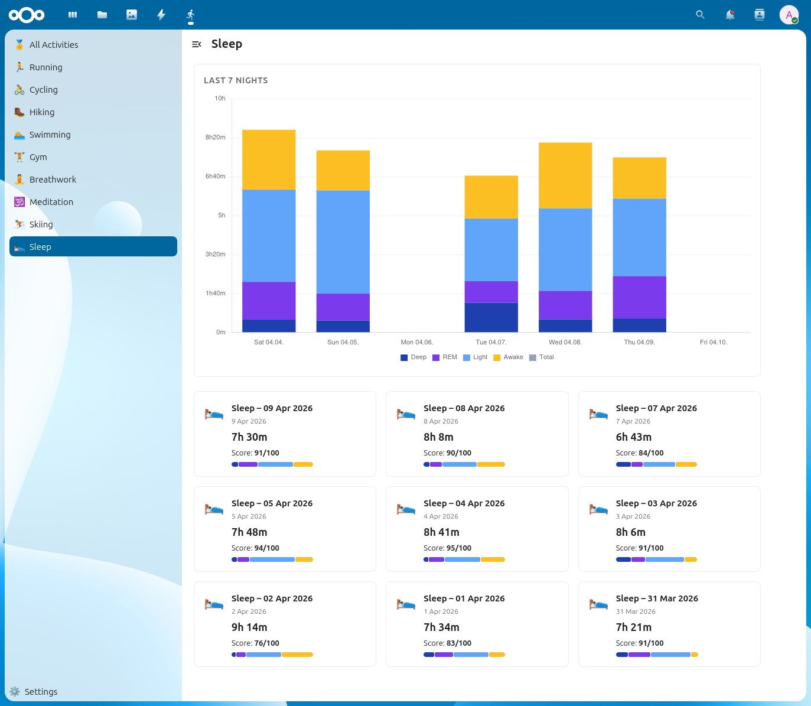
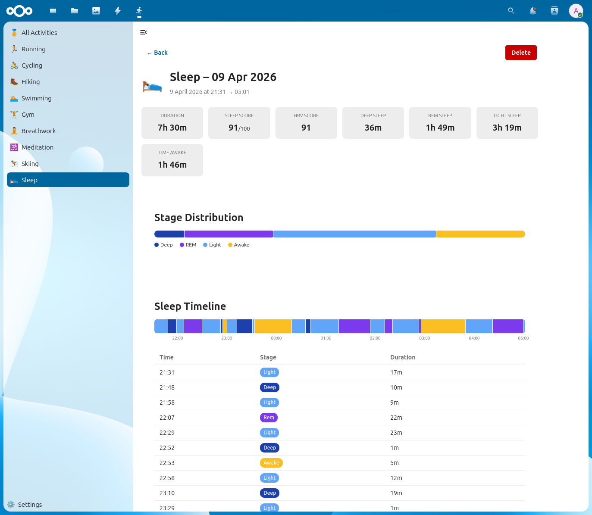

# FIT Tracker

A self-hosted Nextcloud app for tracking your fitness activities and sleep — powered by Garmin `.fit` files stored in your Nextcloud filesystem.

> ⚠️ **This app is vibe coded.**
>
> I am a developer, but I wanted to build something completly with AI. This project is a product of a chat with Claude AI, that lasted for a few hours. Except this few senteces here, everything is generated by AI. Even the rest of this readme.


## What it does

FIT Tracker scans a folder in your Nextcloud for `.fit` files exported from a Garmin device (or any device that produces standard FIT files) and automatically imports them into a database. It then presents your data in a clean dashboard with charts, maps, and detailed views.

### Activity tracking

- **Supported sports:** Running, Cycling, Hiking, Swimming, Gym, Breathwork, Meditation, Skiing
- **Dashboard** shows a monthly activity calendar and a last-7-days bar chart
- **Activity cards** display distance, duration, average heart rate, and calories
- **Detail view** per activity includes:
  - Key stats (distance, pace, heart rate, elevation, calories, cadence)
  - Interactive Leaflet map with GPS route
  - Elevation profile chart
  - Heart rate chart
  - Lap table with per-lap pace/speed, heart rate and distance

### Sleep tracking

- Automatically detects and separates Garmin sleep `.fit` files from activity files
- **Sleep list** shows all recorded sleep sessions with a **last-7-nights stacked bar chart** (Deep / REM / Light / Awake)
- **Dashboard widget** on the main activity page shows your last sleep session with duration, score, HRV and a stage distribution bar
- **Detail view** per sleep session includes:
  - Key stats: total duration, sleep score (0–100), HRV score, time in each stage
  - Stage distribution bar
  - Full sleep timeline — a coloured horizontal band showing every stage transition across the night with hour marks
  - Stage table with timestamps and per-stage duration

### Settings

- Choose any folder in your Nextcloud as the source for `.fit` files
- Re-sync is triggered automatically on folder save or manual navigation

---

## Screenshots

<!-- Add your own screenshots here. Suggested captures:
     - Main dashboard (activity calendar + week chart + last sleep widget)
     - Activity detail with map and charts
     - Sleep list with 7-night chart
     - Sleep detail with timeline
-->

| Dashboard | Activity detail |
|-----------|----------------|
|  |  |

| Sleep list | Sleep detail |
|------------|-------------|
|  |  |

---

## Tech stack

| Layer | Technology |
|-------|-----------|
| Platform | [Nextcloud](https://nextcloud.com) 32+ |
| Backend | PHP 8.1, Nextcloud OCP APIs |
| FIT parsing (activities) | [phpFITFileAnalysis](https://github.com/adriangibbons/php-fit-file-analysis) |
| FIT parsing (sleep) | Custom binary parser (messages 275 / 346 / 521) |
| Frontend | Vue 3 (Options API) + Vue Router |
| Charts | Chart.js 4 |
| Maps | Leaflet 1.9 |
| Nextcloud UI | @nextcloud/vue 9 |

---

## Installation

1. Clone or copy this repository into `<nextcloud>/apps/fit_tracker`
2. Install PHP dependencies:
   ```bash
   composer install --no-dev
   ```
3. Install JS dependencies and build:
   ```bash
   npm install
   npm run build
   ```
4. Enable the app in Nextcloud:
   - Go to **Apps → Your apps** and enable **FIT Tracker**, or run:
   ```bash
   php occ app:enable fit_tracker
   ```
5. Open FIT Tracker from the Nextcloud navigation bar, go to **Settings**, and pick the folder containing your `.fit` files.

---

## How to get `.fit` files

- **Garmin Connect:** Go to an activity → ··· menu → Export Original
- **Garmin device directly:** Connect via USB, files are in `GARMIN/Activity/` and `GARMIN/Sleep/` (or similar paths depending on the device)
- Sleep files are usually named with a pattern like `G4A80020.fit` and are detected automatically — no manual sorting needed

---

## License

AGPL-3.0
